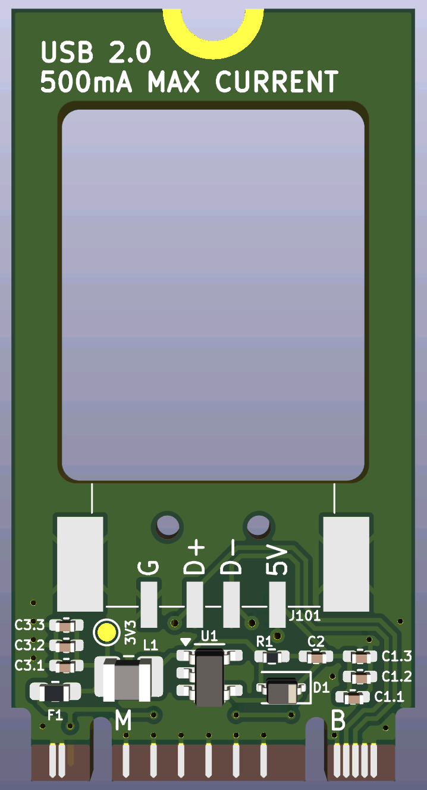
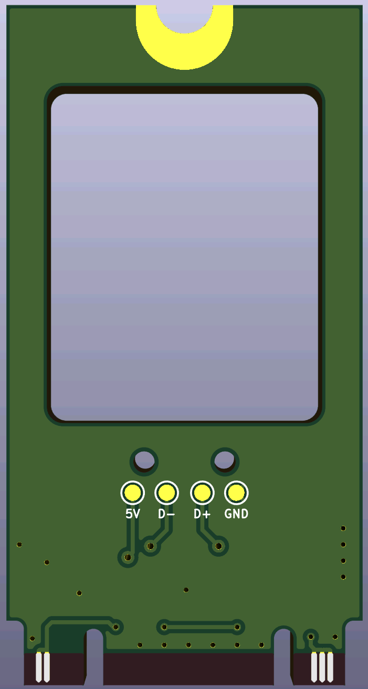

# USB-2242
This is a project to integrate a wireless mouse USB receiver internally for laptops.  Specifically, I designed this to fit an M.2 2242 slot (M+B key) for my Thinkpad X1C6 (replacing the WWAN card).

If space permits, any low-power USB device (under 500 mA) can be plugged into this adapter.

## Features
- M.2 2242 form factor for internal installation
- Optional USB-A receptacle solder pads for testing/thicker laptops
- PCB cutout for minimum height when not using USB-A receptacle
- Resettable fuse to avoid overcurrent/short circuit damage

## Concept

Most thin and light laptops have a limited number of USB ports, especially USB-A ports.  Currently, my Thinkpad X1C6 has 2 USB-C and 2 USB-A ports, and I constantly leave my wireless mouse receiver in one of the USB-A ports.

After seeing similar products available for older laptop models, I couldn't find one that fit in my M.2 2242 slot, so I made my own.  All it does is provide 5V power for the USB device and routes the USB data lines according to the [M.2 specification](https://pcisig.com/specifications/pciexpress/M.2_Specification/) (local copy available [here](docs/SPEC_PCIe-M.2-Rev1.0.pdf)).

## Planned Features
- Separate flex PCB for easier soldering of "floating" USB device

## PCB Renders

|PCB Front|PCB Back|
|---------|--------|
|||