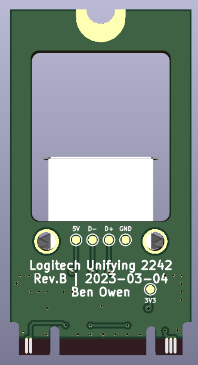

# Logitech-Unifying-2242

This is a project to integrate a Logitech Unifying controller internally for laptops.  Specifically, I am designing the first version to fit an M.2 2242 slot (M+B key) for my Thinkpad X1C6.

|PCB Front|PCB Back|
|---------|--------|
|||